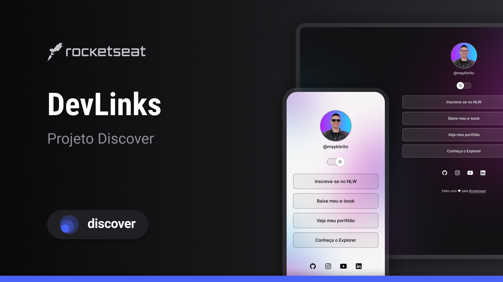

<h1 align="center"> DevLinks </h1>

  Página de links personalizada — meu cartão de visitas online.

  <a href="#-tecnologias">Tecnologias</a>&nbsp;&nbsp;&nbsp;|&nbsp;&nbsp;&nbsp;
  <a href="#-projeto">Projeto</a>&nbsp;&nbsp;&nbsp;|&nbsp;&nbsp;&nbsp;
  <a href="#-layout">Layout</a>&nbsp;&nbsp;&nbsp;|&nbsp;&nbsp;&nbsp;
  <a href="#memo-licença">Licença</a>

  

 

  

## 🚀 Tecnologias

Esse projeto foi desenvolvido com as seguintes tecnologias:

- HTML e CSS
- JavaScript
- Git e Github
- Figma

## 💻 Projeto

O DevLinks é um agregador de links para usar como cartão de visitas online —
uma única página reunindo meus principais contatos e links de trabalho.

- [Acesse o projeto, online](https://sabrinavizeu.github.io/projeto-rocketseat/)

Esse projeto nasceu de um desafio da trilha Explorer, da Rocketseat. Usei o
layout original como ponto de partida e personalizei o conteúdo, os links e
as cores.

## 🔖 Layout

O layout original (antes da minha personalização) pode ser visto
[nesse link do Figma](https://www.figma.com/community/file/1187422022288947321).
É necessário ter conta no [Figma](https://figma.com) para acessá-lo.

## 📝 Licença

Esse projeto está sob a licença MIT.

---

Feito com ♡ por [Sabrina Vizeu](https://github.com/sabrinavizeu)
